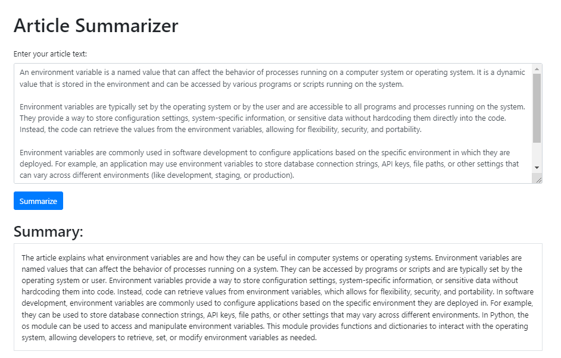

# GEN_AI TEXT_BASED TUTORIALS WITH OPEN_AI

## Dependencies
```console
pip install python-dotenv
```

### .env file
```
AZURE_ENDPOINT = https://www.samplesite/endpoint
API_KEY= 12457845123154561614
API_VERSION= 2024-02-15-preview
```

## RESULTS
### 1. CHAT_PROMPTS
```console
python chat_prompt.py
Yes, other Azure AI services also support customer managed keys. The ability to manage and control your own encryption keys is a feature provided by 
Azure Key Vault, which can be used in conjunction with various Azure AI services like Azure Cognitive Services, Azure Machine Learning, and Azure Bot Service.
```

### 2. ARTICLE_SUMMARY
```console
python article_summary.py
 * Serving Flask app 'article_summary'
 * Debug mode: on
WARNING: This is a development server. Do not use it in a production deployment. Use a production WSGI server instead.
 * Running on http://127.0.0.1:5000
Press CTRL+C to quit
 * Restarting with stat
 * Debugger is active!
 * Debugger PIN: 107-684-231
127.0.0.1 - - [08/Jun/2024 11:12:27] "GET / HTTP/1.1" 200 -
```
> blockquote
Run this url http://127.0.0.1:5000 in browser and provide input and get summarized output



